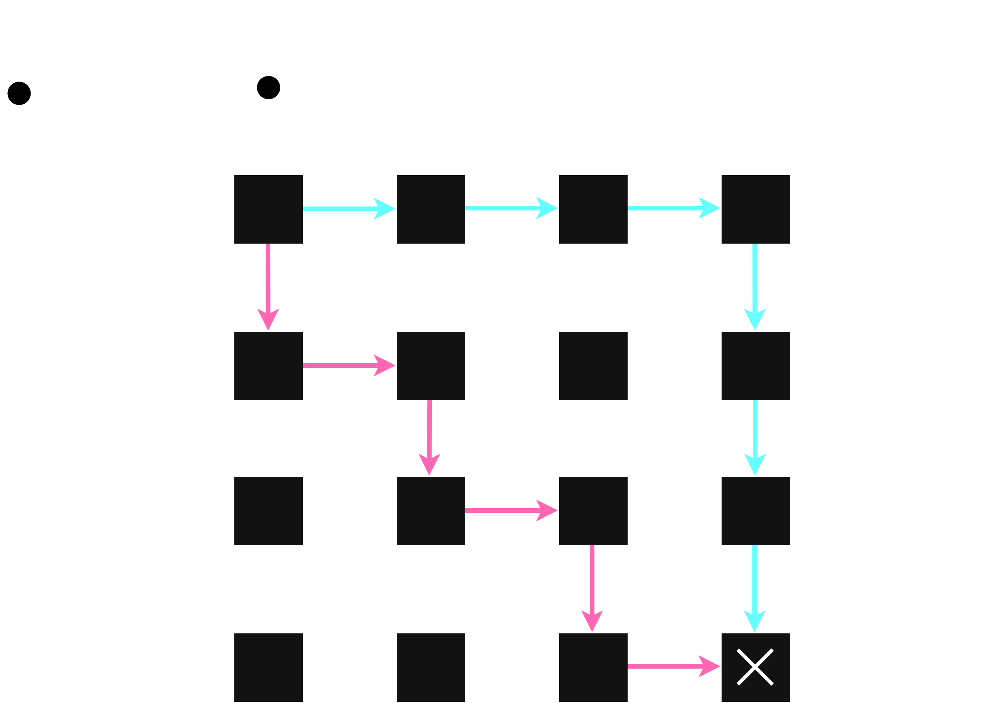
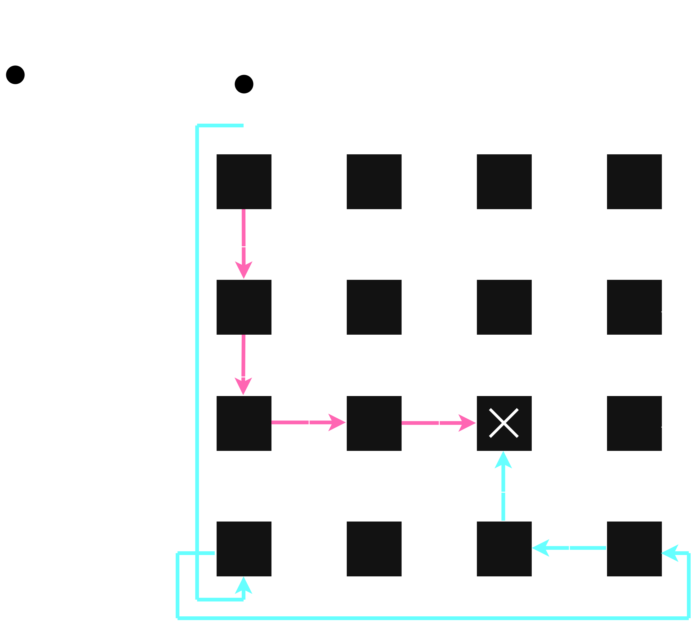
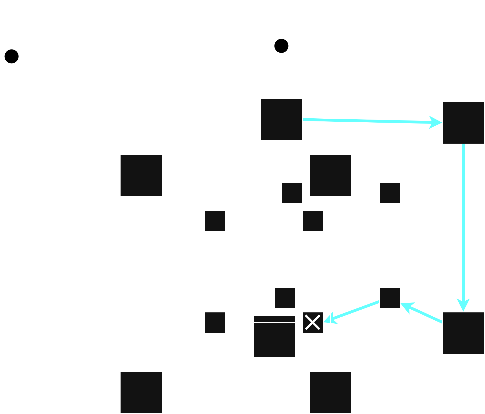
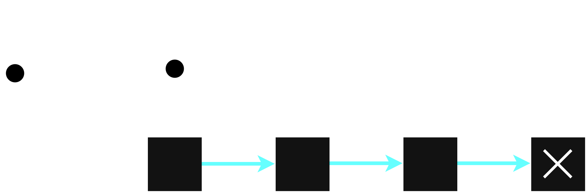

# Aufgabe 1-1 (Architekturen)

##### a) Was unterscheidet statische von dynamischen Netzen?

Statisch

- von vorne festgellegte Verbindungen
- skalieren oft besser in Bezug auf die Bandbreite pro Knoten
- Möglichkeiten:
  - Ring
  - Hypercube
  - (Fat | X) Tree
  - Cube Connected Cycles CCC(d)
  - Butterfly-Graph

Dynamisch

- Verbindungen werden über Schalterkonfigurationen zur Laufzeit Verbunden _(switched by Request)_
  - Bs.: Bus - gemeinsames Netz
- asymptotischer Wachstum von Kosten und Performance
- Blocking und Non-Blocking Kategorie
  - Non-Blocking performanter
- Möglichkeiten:
  - Bus: Singele- und Multi-Buss
  - Crossbar-Switch
  - Multistage Networks

##### b) Welche Art von Verbindungsnetzwerk und welche Topologie weisen die fünf aktuell schnellsten Supercomputer nach der Top500-Liste (www.top500.org) auf?

Alle 5 Systeme verwenden statische Netzwerke um eine möglichst hohe Performance, Skalierbarkeit und Stabilität zu erreichen.
´

1. **El Capitan:**
2. **Frontier:**
3. **Aurora:**
   - Technologie: Interconnect - Slingshot-11
   - Topologie: Dragonfly
     - teilt Router in Gruppen, welche verbunden sind in vollständig verlinktem Netzwerk
     - unterstützt bis zu 278,528 endpoints unter benutzung von 32 switches

https://www.ietf.org/archive/id/draft-agt-rtgwg-dragonfly-routing-01.html

4. **JUPITER Booster:**
5. **Eagle:**
   - Technologie: Interconnect - (Quad-Rail) NVIDIA InfiniBand NDR200
   - Topologie: Fat Tree
     - subnet manager (SM) um traffic zu routen
       - 3 Schichten - switches: IB0, IB1, and IB2
     - können mit 400Gb/s per port umgehen

https://www.glennklockwood.com/garden/InfiniBand

##### c) Wie viele unterschiedliche kürzeste Wege zwischen zwei maximal entfernten Knoten gibt es in den folgenden Netzwerktopologien? Wie groß ist die maximale Entfernung? Welche Auswirkungen hat das?

1. **2D-Gitter mit n x n Knoten**
   - max: (n - 1) + (n - 1) = 2(n - 1)
     
     n = 4
    d~max = 6
2. **2D-Torus mit n x n Knoten**
   - max: n
     
     n = 4
     d~max = 4
3. **Hypercube mit der Dimension n**
   - max: n
     
     n = 4
     d~max = 4
4. **Bus mit n Knoten**
   - max: n - 1
     
     n = 4
     d~max = 6
